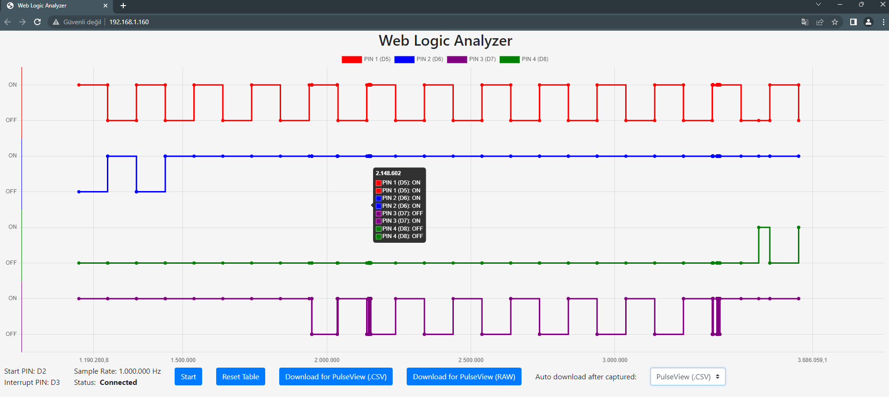
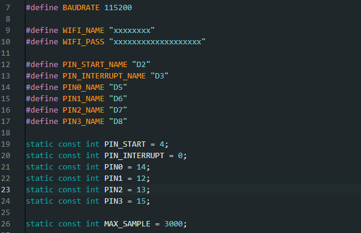
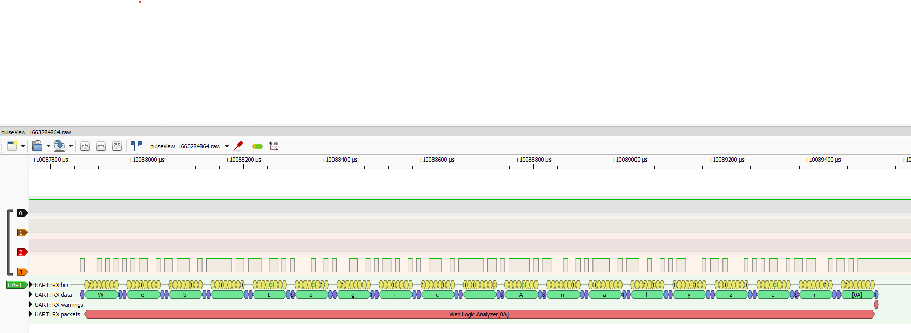

# Web Logic Analyzer

Web Logic Analyzer allows digital signals to be captured and viewed on the web for analysis.

In this project, the main target is to capture the signals wirelessly and download them in appropriate formats rather than analyzing the signals with the web interface. The web interface can be made even more functional in the future.

PulseView supported file formats can be downloaded via the web interface.

The automatic download feature in the web interface, the signal capture feature is started with the button, and when the signal is captured without being at the computer, the signals captured by the browser are automatically downloaded in the selected format.

I developed the project for the ESP8266 NodeMCU V3 I have and just tested it with it. I cannot guarantee its functionality for other variants.

For more advanced signal capture and analysis needs, I coded a web-based version inspired by the aster94 project [here](https://github.com/aster94/logic-analyzer).

## Usage

Necessary settings should be made appropriately as in the picture.

The Start and Interrupt pins are not obligatory, but are set to 3000 sample rate by default and will continue to capture indefinitely until this limit is reached. To terminate this earlier, it can be terminated with the Interrupt pin connection. So it might be helpful to at least use a button for Interrupt.

Although pin names do not work functionally, they are only used for naming in the web interface and for the saved file format.

## Notes
- The hardware watchdog is disabled during capture in order to capture long-term obscure signals.
- Even if the socket connection in the web interface is lost, it will automatically connect and continue to download signals after signal capture. Therefore, the web page should not be refreshed during capture.
- Be sure to enter the correct sample rate (1.000.000hz) when importing so that you can decode the signals correctly in PulseView.
- You can download PulseView software from [here](https://sigrok.org/wiki/Downloads) to view the captured signals.
  

## Change Log

### 1.0.0

- Initial release
